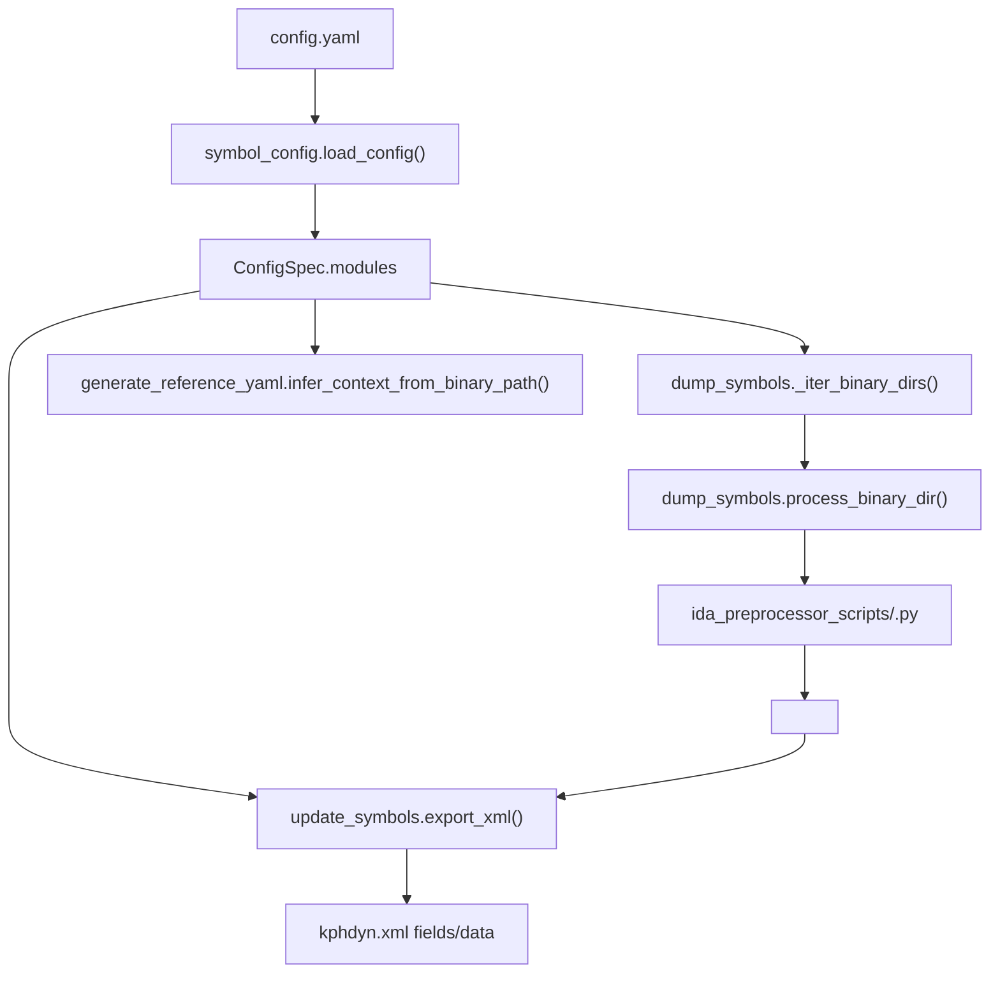

# config.yaml

## Overview
`config.yaml` is the repository-level symbol generation inventory. It declares target binaries, ordered symbol-finding skills, intermediate YAML artifact dependencies, and the symbol metadata later exported into `kphdyn.xml`.

## Responsibilities
- Define the modules and binary filename aliases scanned under `symboldir/<arch>/<file>.<version>/<sha>/`.
- Declare skill outputs and dependencies used by `dump_symbols.py` to preprocess symbols through IDA MCP or fall back to `.claude/skills`.
- Declare the exported symbol inventory used by `update_symbols.py` to turn generated YAML artifacts into XML field values.
- Provide module/path context for `generate_reference_yaml.py` when it infers the current binary's module and architecture.

## Involved Files & Symbols
- `config.yaml` - current YAML inventory; currently one `ntoskrnl` module with `ntoskrnl.exe` and `ntkrla57.exe` paths.
- `symbol_config.py` - `ConfigSpec`, `ModuleSpec`, `SkillSpec`, `SymbolSpec`, `load_config`, `_load_skill`, `_load_symbol`, `symbol_name_from_artifact_name`.
- `dump_symbols.py` - `topological_sort_skills`, `_iter_binary_dirs`, `_resolve_binary_path`, `process_binary_dir`, `_process_one_skill`, `_preprocess_skill_outputs`, `run_skill`.
- `ida_skill_preprocessor.py` - `_get_preprocess_entry`, `preprocess_single_skill_via_mcp`.
- `ida_preprocessor_common.py` - `preprocess_common_skill`, `_infer_symbol_category`, `_filter_payload`.
- `update_symbols.py` - `export_xml`, `_load_module_yaml`, `collect_symbol_values`, `fallback_value`.
- `generate_reference_yaml.py` - `_match_module_spec`, `infer_context_from_binary_path`, `run_reference_generation`.
- `tests/test_symbol_config.py` - schema acceptance and rejection coverage for `config.yaml` fields.
- `tests/test_dump_symbols.py` - dependency ordering, optional output, preprocessor-only output, `skip_if_exists`, and retry/fallback behavior.

## Architecture
`symbol_config.load_config()` parses the YAML with `yaml.safe_load`, requires a non-empty top-level `modules` list, and returns typed dataclasses. Skill and symbol entries reject unknown fields, but top-level and module-level unknown keys are currently ignored by the loader.

Field semantics:
- `modules`: required non-empty top-level list; each item becomes a `ModuleSpec`.
- `modules[].name`: required non-empty string; logical module name used by reference-generation context inference.
- `modules[].path`: required non-empty string list; binary filename aliases used to scan version directories and choose the concrete binary inside a SHA directory. Current values are `ntoskrnl.exe` and `ntkrla57.exe`.
- `modules[].skills`: required non-empty list of skill entries; each entry describes one artifact-producing step.
- `modules[].symbols`: required non-empty list of exported symbols; this list, not the skill outputs alone, controls what `update_symbols.py` exports into XML fields.
- `skills[].name`: required non-empty string; maps to `ida_preprocessor_scripts/<name>.py` for IDA MCP preprocessing and to `.claude/skills/<name>/SKILL.md` for fallback execution.
- `skills[].expected_output`: required only when both `optional_output` and `preprocessor_only_output` are absent; required generated artifacts. Each item must end with `.yaml`, must not include `.amd64.yaml` or `.arm64.yaml`, and its stem becomes the symbol name.
- `skills[].optional_output`: optional generated artifacts. They are attempted during preprocessing, but failures do not fail the skill; if a skill has required outputs, existing required outputs are enough to skip it, even if optional outputs are absent. Optional outputs are ignored as dependency producers in `topological_sort_skills()`.
- `skills[].preprocessor_only_output`: required generated artifacts intended for helper/internal data. They participate in required output checks and dependency ordering, but XML export still depends on whether the symbol also appears in `modules[].symbols`.
- `skills[].expected_input`: artifact dependency list used only for topological sorting. Inputs are matched against producers by normalized path or basename.
- `skills[].expected_input_amd64` and `skills[].expected_input_arm64`: architecture-labeled dependency lists accepted by the schema; the current sorter includes both lists when ordering skills, rather than filtering by the current run architecture.
- `skills[].skip_if_exists`: artifact list that skips the skill when all listed artifacts already exist in the binary directory.
- `skills[].max_retries`: integer or null; `_process_one_skill()` defaults to `3` and passes this value to `run_skill()`, although the current fallback implementation invokes the agent subprocess once.
- `symbols[].name`: required non-empty string; logical exported symbol name and expected YAML artifact basename (`<name>.yaml`).
- `symbols[].category`: required non-empty string; controls payload interpretation. Supported runtime categories are `struct_offset`, `gv`, and `func`.
- `symbols[].data_type`: required non-empty string; controls fallback values when an exported artifact is missing. `uint16` maps to `0xffff`; `uint32` maps to `0xffffffff`.

Workflow:

## Dependencies
- External: `PyYAML` via `yaml.safe_load`.
- Internal: `symbol_config`, `dump_symbols`, `ida_skill_preprocessor`, `ida_preprocessor_common`, `symbol_artifacts`, `update_symbols`, `generate_reference_yaml`.
- Runtime resources: `ida_preprocessor_scripts/<skill>.py`, optional `.claude/skills/<skill>/SKILL.md`, `symboldir/<arch>/<file>.<version>/<sha>/`, generated `<symbol>.yaml` artifacts, PE/PDB files.

## Notes
- Artifact output filenames in `expected_output`, `optional_output`, `preprocessor_only_output`, and `skip_if_exists` must be architecture-neutral `.yaml` names; arch-specific reference YAML files live elsewhere and are not valid output names here.
- `symbols[]` is the authoritative XML export inventory. A skill can generate an artifact without a matching symbol spec, but `update_symbols.py` will not export it unless it appears in `symbols[]`.
- `collect_symbol_values()` reads `offset` or `offset` plus `bit_offset` for `struct_offset`, `gv_rva` for `gv`, and `func_rva` for `func`.
- Legacy skill fields such as `agent_skill` and `symbol`, and legacy symbol locating fields such as `symbol_expr`, `struct_name`, `member_name`, `bits`, and `alias`, are explicitly rejected.
- `dump_symbols.topological_sort_skills()` still has a `prerequisite` lookup for raw dict inputs, but `symbol_config.load_config()` does not allow `skills[].prerequisite`, so normal `config.yaml` loading cannot use it.
- The repository baseline test asserts that the current config has one module named `ntoskrnl`, at least one exported symbol, no exported `NtSecureConnectPort` symbol, and that every skill has at least one produced symbol.

## Callers
- `dump_symbols.main` loads `config.yaml` by default and processes each configured module/binary directory.
- `update_symbols.main` loads `config.yaml` for the non-`-syncfile` YAML-to-XML export path.
- `generate_reference_yaml.run_reference_generation` loads the repository `config.yaml` to infer module context for the current binary.
