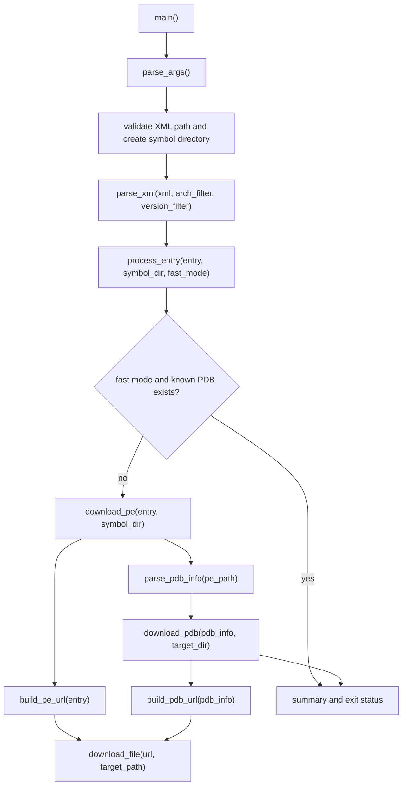

# download_symbols.py

## Overview
`download_symbols.py` is the PE/PDB download entry point for kphdyn symbol preparation. It reads `<data>` entries from `kphdyn.xml`, downloads matching PE files from a symbol server, extracts CodeView PDB metadata from each PE, and downloads the corresponding PDB into the symbol directory layout.

## Responsibilities
- Parse command-line options for XML input, symbol directory, architecture/version filters, symbol-server URL, and fast mode.
- Apply environment overrides from `KPHTOOLS_XML`, `KPHTOOLS_SYMBOLDIR`, and `KPHTOOLS_SYMBOL_SERVER`.
- Parse `kphdyn.xml` `<data>` elements into per-binary download entries, skipping `lxcore.sys` and entries without a `hash` attribute.
- Build Microsoft Symbol Server PE URLs from XML timestamp and image-size values.
- Download PE and PDB files into `{symboldir}/{arch}/{file}.{version}/{hash}/`.
- Parse PDB filename and GUID+Age signature from PE CodeView debug information using `pefile`.
- Provide fast-mode skipping for known kernel PDB names when they already exist locally.
- Report per-entry success/failure counts and exit nonzero if any entry fails.

## Involved Files & Symbols
- `download_symbols.py` - `parse_args`, `main`
- `download_symbols.py` - `parse_xml`, `process_entry`
- `download_symbols.py` - `build_pe_url`, `download_pe`, `download_file`
- `download_symbols.py` - `parse_pdb_info`, `build_pdb_url`, `download_pdb`
- `download_symbols.py` - `check_fast_skip`
- `README.md` - documented download workflow and expected symbol directory layout
- `tests/test_download_symbols.py` - unit coverage for `parse_args` defaults and environment overrides

## Architecture
The script is organized as a single CLI pipeline. `main()` resolves runtime configuration, validates the XML file, creates the output symbol directory, parses eligible XML entries, and processes them one by one. `process_entry()` is the per-entry workflow boundary: it optionally applies fast-mode skipping, downloads the PE, extracts PDB metadata from the PE, and downloads the PDB into the same hash directory.

Important internal boundaries:
- CLI/environment handling is isolated in `parse_args`; environment variables override command-line/default values before returning the parsed namespace.
- `SYMBOL_SERVER_URL` is a module-level mutable global updated by `parse_args` and consumed by both URL builders.
- `parse_xml` only reads top-level `<data>` elements and returns plain dictionaries with `arch`, `version`, `file`, `timestamp`, `size`, and lowercase `hash` values.
- `build_pe_url` uses the Microsoft symbol-store key `{timestamp}{size}` where timestamp is uppercase hex without `0x` and size is uppercase hex without leading zeroes.
- `parse_pdb_info` opens the PE with `pefile.PE(fast_load=False)`, searches `DIRECTORY_ENTRY_DEBUG` for `IMAGE_DEBUG_TYPE_CODEVIEW`, reads `PdbFileName`, strips any embedded Windows path to the filename, and uses `Signature_String` as the PDB signature.
- `download_file` performs an HTTP GET with a 600-second timeout, stores the entire response content in memory, creates the target parent directory, and writes the file only after the download completes.

## Dependencies
- Python standard library: `argparse`, `os`, `sys`, `xml.etree.ElementTree`.
- Third-party libraries: `requests` for HTTP downloads and `pefile` for PE debug-directory parsing.
- Runtime inputs: `kphdyn.xml` data entries with `arch`, `version`, `file`, `timestamp`, `size`, and `hash` attributes.
- Runtime services: Microsoft Symbol Server by default, or another compatible server through `-symbol_server` / `KPHTOOLS_SYMBOL_SERVER`.
- Output layout: `{symboldir}/{arch}/{file}.{version}/{hash}/{file}` plus the downloaded PDB in the same directory.

## Notes
- `parse_xml` consumes only the `hash` XML attribute; entries that only use a legacy or alternate hash attribute name are skipped.
- `parse_xml` assumes filtered entries have a non-empty `version` when `-version` is used because it calls `version.startswith(version_filter)`.
- `lxcore.sys` is intentionally ignored even when present in `kphdyn.xml`.
- Fast mode is limited to known PDB names for `ntoskrnl.exe` (`ntkrnlmp.pdb` or `ntoskrnl.pdb`) and `ntkrla57.exe` (`ntkrla57.pdb`); other files still run the full PE/PDB workflow.
- Existing PE or PDB files are reused without content verification in this script.
- `download_file` keeps the whole response body in memory before writing, which avoids partially written files but can increase memory use for large PDB downloads.
- If a PE download, PDB metadata parse, or PDB download fails for any entry, `main()` records a failure and exits with status `1` after processing all entries.

## Callers
- `download_symbols.py` module entrypoint: `if __name__ == "__main__": main()`.
- README workflow commands invoke `uv run python download_symbols.py ...` for initial PE/PDB downloads, including the documented `-fast` mode.
- `tests/test_download_symbols.py` imports `download_symbols` and exercises `parse_args`.
