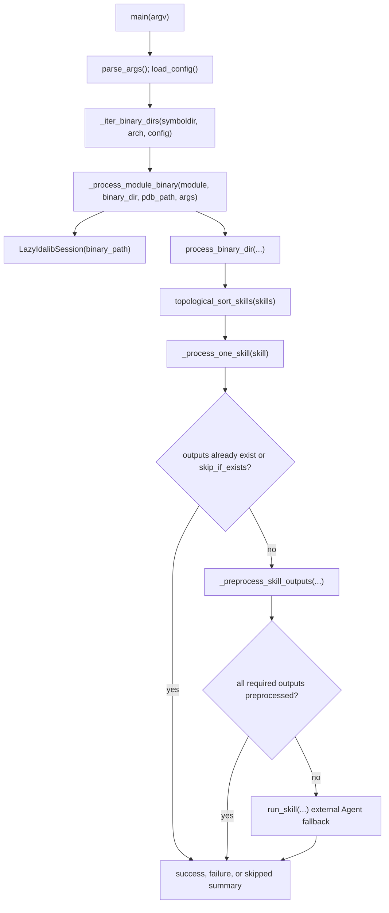

# dump_symbols.py

## Overview
`dump_symbols.py` is the primary YAML symbol artifact dumping entry point. It scans configured binary symbol directories, runs per-module skill pipelines, uses IDA through `idalib-mcp` for preprocessor-backed extraction, and falls back to an external Agent CLI when required artifacts cannot be produced by preprocessors alone.

## Responsibilities
- Parse CLI and `.env` configuration for symbol root, module config YAML, target architectures, force/debug behavior, external Agent CLI, and optional OpenAI-compatible LLM settings.
- Load module, skill, and symbol definitions from `config.yaml` through `symbol_config.load_config`.
- Enumerate candidate binary directories under `symboldir/<arch>/<module_path>.<version>/<sha256>/`, accepting directories with either a PDB or the configured binary file.
- Sort skills topologically from declared produced artifacts, expected inputs, architecture-specific expected inputs, and explicit prerequisites.
- Skip work when required/optional outputs already exist or when `skip_if_exists` artifacts are present, unless `-force` requires regeneration.
- Run preprocessor output generation through `ida_skill_preprocessor.preprocess_single_skill_via_mcp`, using a lazily started IDA MCP session.
- Fall back to `.claude/skills/<skill>/SKILL.md` via an external Agent CLI when regular required outputs fail preprocessing.
- Track per-binary work activity and report succeeded, failed, skipped, and no-candidate summaries.

## Involved Files & Symbols
- `dump_symbols.py` - `main`, `parse_args`, `_iter_binary_dirs`, `_resolve_binary_path`, `_process_module_binary`, `process_binary_dir`, `_process_one_skill`, `_preprocess_skill_outputs`, `topological_sort_skills`, `run_skill`, `LazyIdalibSession`, `start_idalib_mcp`, `_open_session`, `_session_matches_binary`
- `symbol_config.py` - `load_config`, `SkillSpec`, `SymbolSpec`, `ModuleSpec`, `ConfigSpec`, `symbol_name_from_artifact_name`
- `ida_skill_preprocessor.py` - `preprocess_single_skill_via_mcp`, `PREPROCESS_STATUS_SUCCESS`, `PREPROCESS_STATUS_FAILED`, `PREPROCESS_STATUS_ABSENT_OK`
- `generate_reference_yaml.py` - reuses `SURVEY_CURRENT_IDB_PATH_PY_EVAL`, `_parse_py_eval_result_json`, `_open_session`, `_session_matches_binary`, `start_idalib_mcp`, and `IDALIB_QEXIT_TIMEOUT_SECONDS`
- `tests/test_dump_symbols.py` - covers CLI parsing, skill ordering, preprocessing/fallback behavior, lazy MCP startup/cleanup, binary directory enumeration, and `main` summaries
- `README.md` - documents the `dump_symbols.py` usage and symbol directory layout

## Architecture
The script is organized as a CLI orchestration layer over three boundaries: repository config parsing, skill pipeline execution, and IDA/MCP session lifecycle management. `main()` owns architecture-level scanning and summary accounting. `_process_module_binary()` resolves the concrete PE path, constructs a `LazyIdalibSession`, and delegates all skill execution to `process_binary_dir()`. The lazy session starts `idalib-mcp` only when a preprocessor actually calls a tool, so binaries whose outputs already exist can be skipped without launching IDA.

`topological_sort_skills()` infers producers from `expected_output` and `preprocessor_only_output`, then links consumers through `expected_input`, `expected_input_amd64`, `expected_input_arm64`, and explicit `prerequisite` names. Optional outputs are intentionally excluded from dependency production. If a cycle or unresolved ordering remains, unsorted skills are appended in original config order.

`_preprocess_skill_outputs()` derives output symbol names from expected, optional, and preprocessor-only artifacts, then calls `preprocess_single_skill_via_mcp()` for each one. Required outputs must succeed unless they are internal outputs with `PREPROCESS_STATUS_ABSENT_OK`; internal required failures return `False` without Agent fallback. Regular required failures fall back to `run_skill()`.

`LazyIdalibSession.ensure_started()` allocates a local TCP port, starts `uv run idalib-mcp --unsafe --host <host> --port <port> <binary>`, opens a streamable HTTP MCP client session, initializes it, and validates that the current IDB path belongs to the target binary. Startup failures clean up sessions, streams, and subprocesses. `close()` tries `idc.qexit(0)` through `py_eval`, closes MCP handles, waits for the subprocess, and kills it after timeout.

## Dependencies
- Internal modules: `symbol_config` for config schema loading and artifact-to-symbol name mapping; `ida_skill_preprocessor` for skill-specific MCP preprocessors and status constants.
- Standard library: `argparse`, `asyncio`, `json`, `os`, `socket`, `subprocess`, `time`, `pathlib.Path`, and `typing.Any`.
- Runtime MCP dependency: `mcp.ClientSession` and `mcp.client.streamable_http.streamable_http_client`, imported inside `_open_session`.
- External tools: `uv`, `idalib-mcp`, IDA APIs reachable through MCP `py_eval`, and an external Agent CLI executable named by `-agent` (`codex` by default).
- Repository resources: `config.yaml`, `.env`, `.claude/skills/<skill>/SKILL.md`, `.claude/agents/sig-finder.md`, and symbol directories under `symbols/` by default.
- Optional LLM configuration: `KPHTOOLS_LLM_MODEL`, `KPHTOOLS_LLM_APIKEY`, `KPHTOOLS_LLM_BASEURL`, `KPHTOOLS_LLM_TEMPERATURE`, `KPHTOOLS_LLM_EFFORT`, and `KPHTOOLS_LLM_FAKE_AS`, or matching CLI arguments.

## Notes
- Supported architectures are currently `amd64` and `arm64`; the default scans both.
- `MCP_STARTUP_TIMEOUT` is long (`1200` seconds), so a stalled `idalib-mcp` startup may wait for a substantial time before failing.
- `run_skill()` accepts `max_retries`, but the implementation calls the external Agent CLI once and then verifies that all expected YAML paths exist.
- `run_skill()` requires both `.claude/skills/<skill>/SKILL.md` and non-empty `.claude/agents/sig-finder.md`; missing files cause a `False` result instead of raising.
- Optional-only skills are skipped when preprocessing does not generate optional outputs; required output failures can fail the binary or trigger Agent fallback depending on whether the failed symbol is considered internal.
- `LazyIdalibSession` deliberately avoids eager MCP startup, which is important for fast no-op runs where artifacts already exist.
- `_session_matches_binary()` compares the current IDB path name prefix and parent directory to the target binary; mismatch causes startup cleanup and a runtime error.
- `close()` suppresses known MCP cancel-scope cancellation noise during normal session/stream shutdown but re-raises unrelated cancellation errors after cleanup.

## Callers
- `dump_symbols.py` CLI entry point invokes `main()` through `if __name__ == "__main__"`.
- `generate_reference_yaml.py` imports and reuses selected MCP/session helper symbols from `dump_symbols.py`.
- `tests/test_dump_symbols.py` imports `dump_symbols` and directly exercises the main pipeline, helper functions, and `LazyIdalibSession` lifecycle.
