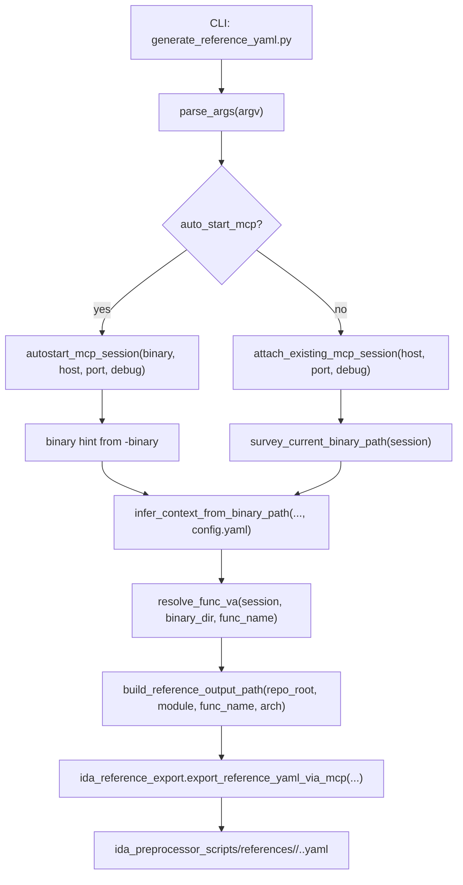

# generate_reference_yaml.py

## Overview
`generate_reference_yaml.py` is a CLI orchestration script for producing one LLM decompile reference YAML from an IDA database through an MCP session. It resolves the current module, architecture, binary directory, and function VA, then delegates the actual YAML extraction and validation to `ida_reference_export.export_reference_yaml_via_mcp`.

## Responsibilities
- Parse CLI options for the target function, optional module/architecture overrides, MCP endpoint, debug mode, and auto-start binary mode.
- Attach to an existing IDA MCP session or auto-start `idalib-mcp` for a provided binary, including target-binary verification and cleanup.
- Infer `module`, `arch`, `binary_dir`, and concrete `binary_path` from the current IDB/binary path and `config.yaml` module specs.
- Resolve the target function VA from a local function artifact when available, or by exact-name lookup inside IDA via MCP `py_eval`.
- Build the deterministic output path under `ida_preprocessor_scripts/references/<module>/<func_name>.<arch>.yaml` and trigger reference YAML export.

## Involved Files & Symbols
- `generate_reference_yaml.py` - `parse_args`, `build_reference_output_path`, `infer_context_from_binary_path`, `resolve_func_va`, `survey_current_binary_path`, `attach_existing_mcp_session`, `autostart_mcp_session`, `run_reference_generation`, `main`
- `generate_reference_yaml.py` - helpers `_match_module_spec`, `_find_arch_from_path`, `_normalize_component`, `_lookup_function_start_addresses_by_exact_name`, `_query_image_base_via_ida`, `_parse_py_eval_result_json`
- `ida_reference_export.py` - `export_reference_yaml_via_mcp`, `build_reference_yaml_export_py_eval`, `validate_reference_yaml_payload`, `ReferenceGenerationError`
- `dump_symbols.py` - `_open_session`, `_session_matches_binary`, `start_idalib_mcp`, `SURVEY_CURRENT_IDB_PATH_PY_EVAL`, `IDALIB_QEXIT_TIMEOUT_SECONDS`, `_resolve_binary_path`
- `symbol_config.py` - `load_config`, `ConfigSpec`, `ModuleSpec`
- `symbol_artifacts.py` - `load_artifact`
- `tests/test_generate_reference_yaml.py` - coverage for argument validation, path construction, context inference, function VA resolution, attach-mode workflow, and `main`

## Architecture
The script is a thin CLI and session-lifecycle layer. `main()` parses arguments and runs the async workflow. `run_reference_generation()` chooses either attach mode or auto-start mode, obtains the binary hint, infers repository context from the binary path and `config.yaml`, resolves the function VA, computes the reference YAML target path, and delegates the IDA-side export.

Context inference is intentionally path- and config-driven. `_find_arch_from_path()` scans path components for supported architectures (`amd64`, `arm64`). `_match_module_spec()` first checks whether files named by `ModuleSpec.path` exist in the binary directory, then falls back to matching the version directory prefix. A user-provided `-module` override must equal the inferred module name, so overrides cannot silently redirect output to a different module.

Function VA resolution is staged. `resolve_func_va()` first reads `<binary_dir>/<func_name>.yaml` through `symbol_artifacts.load_artifact`; `func_va` is used directly, while `func_rva` is converted with the IDA image base queried through MCP. If no artifact is present, `_lookup_function_start_addresses_by_exact_name()` asks IDA for an exact named address and requires exactly one unique function start.

`ida_reference_export.export_reference_yaml_via_mcp()` owns the actual export contract. It sends generated Python to IDA `py_eval`, writes YAML remotely, validates the remote acknowledgement, reads the written YAML back locally, and validates required fields (`func_name`, `func_va`, `disasm_code`, `procedure`, optional `optional_funcs`).

## Dependencies
- Standard library: `argparse`, `asyncio`, `json`, `subprocess`, `sys`, `contextlib.asynccontextmanager`, `pathlib.Path`, and `typing.Any`.
- Internal modules: `ida_reference_export` for errors, remote YAML export, and payload validation; `dump_symbols` for MCP startup/session helpers and binary survey code; `symbol_config` for `config.yaml` parsing; `symbol_artifacts` for existing YAML artifact loading.
- Runtime tools and services: `idalib-mcp`, IDA Python APIs exposed through MCP `py_eval`, and an HTTP MCP endpoint at `http://<host>:<port>/mcp`.
- Repository resources: `config.yaml`, symbol binary directories, optional per-function artifacts named `<func_name>.yaml`, and output directory `ida_preprocessor_scripts/references/`.

## Notes
- `-binary` and `-auto_start_mcp` are coupled: each requires the other. Without auto-start, the script surveys the currently attached IDA database path from the existing MCP session.
- Supported architectures are hard-coded to `amd64` and `arm64`; output path construction rejects any other architecture and rejects module/function names containing path separators or invalid filename characters.
- Module override is a consistency check, not a manual routing mechanism; a mismatch with the inferred binary directory raises `ReferenceGenerationError`.
- Exact-name IDA lookup is strict: zero matches fail with `unable to resolve function address`, and multiple unique function starts fail with `multiple function addresses`.
- Auto-start cleanup tries `idc.qexit(0)`, closes MCP session/streams, waits up to 10 seconds for the subprocess, and kills it if it does not exit.
- All expected user-facing workflow failures are normalized to `ida_reference_export.ReferenceGenerationError`; `main()` prints those messages to stderr and returns exit code `1`, while unexpected exceptions are re-raised.

## Callers
- `generate_reference_yaml.py` invokes `main()` through `if __name__ == "__main__"` for CLI execution.
- `main()` calls `run_reference_generation()` and prints the generated path on success.
- `run_reference_generation()` calls `infer_context_from_binary_path()`, `resolve_func_va()`, `build_reference_output_path()`, and `export_reference_yaml_via_mcp()`.
- `tests/test_generate_reference_yaml.py` imports this module and directly exercises the public workflow and key helper functions.
