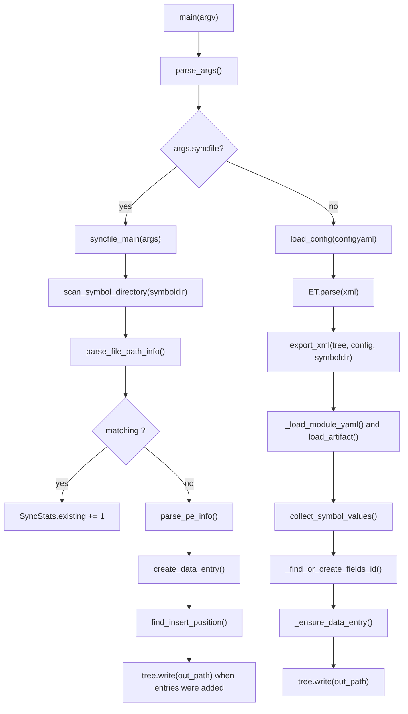

# update_symbols.py

## Overview
`update_symbols.py` is the XML export and file-synchronization entry point for kphdyn symbol data. The current implementation no longer parses PDBs directly; it consumes YAML symbol artifacts and PE metadata from the symbol directory to update `kphdyn.xml` `<data>` and `<fields>` mappings.

## Responsibilities
- Parse command-line options for XML input/output, symbol directory, config YAML, sync-only mode, and debug logging.
- Synchronize missing XML `<data>` entries from the on-disk symbol directory layout.
- Validate symbol-directory path shape and SHA-256 directory names before using PE files.
- Extract PE timestamp and image size with `pefile`, and verify SHA-256 in `-syncfile` mode.
- Load configured module symbol specs and colocated `<symbol>.yaml` artifacts, then convert them into XML field values.
- Reuse existing `<fields>` elements when values match, or allocate a new fields id when needed.
- Ensure matching `<data>` entries exist and attach the resolved fields id during normal export.

## Involved Files & Symbols
- `update_symbols.py` - `parse_args`, `main`, `syncfile_main`, `export_xml`
- `update_symbols.py` - `FilePathInfo`, `SyncStats`, `HashMismatchError`
- `update_symbols.py` - `scan_symbol_directory`, `parse_file_path_info`, `find_data_entry`, `create_data_entry`, `find_insert_position`
- `update_symbols.py` - `parse_pe_info`, `_calculate_sha256`, `_load_binary_metadata`
- `update_symbols.py` - `collect_symbol_values`, `_load_module_yaml`, `_find_or_create_fields_id`, `_ensure_data_entry`
- `symbol_config.py` - `load_config`, `ModuleSpec`, `SymbolSpec`
- `symbol_artifacts.py` - `load_artifact`
- `tests/test_update_symbols.py` - unit coverage for CLI parsing, path parsing, syncfile behavior, PE metadata, YAML value conversion, and XML export behavior

## Architecture
The script has two top-level workflows selected by `main()`. With `-syncfile`, it only scans `{symboldir}/{arch}/{binary}.{version}/{sha256}/{binary}` and adds missing `<data>0</data>` entries. Without `-syncfile`, it loads `config.yaml`, walks configured module paths under `amd64` and `arm64`, reads colocated symbol YAML artifacts, computes field values, and writes the matching fields id onto each `<data>` entry.

Important internal boundaries:
- CLI/environment handling is isolated in `parse_args`; `KPHTOOLS_XML` and `KPHTOOLS_SYMBOLDIR` override parsed/default values.
- Directory discovery is intentionally lightweight in `scan_symbol_directory`; strict validation is deferred to `parse_file_path_info`.
- `find_data_entry` and `_ensure_data_entry` support both `hash` and legacy `sha256` XML attributes.
- `collect_symbol_values` maps `struct_offset` to `offset` or bitfield bit position, `gv` to `gv_rva`, and `func` to `func_rva`.
- Missing symbol artifacts are exported as fallback values: `uint16` -> `0xffff`, `uint32` -> `0xffffffff`.
- `_find_or_create_fields_id` compares sorted `(name, value)` pairs to reuse existing `<fields>` entries before appending a new one.

## Dependencies
- Python standard library: `argparse`, `dataclasses`, `hashlib`, `os`, `pathlib.Path`, `xml.etree.ElementTree`.
- Third-party library: `pefile` for PE timestamp and image-size extraction.
- Internal modules: `symbol_config.load_config` for `config.yaml`; `symbol_artifacts.load_artifact` for generated YAML symbol artifacts.
- Runtime inputs: `kphdyn.xml`, `config.yaml`, and the symbol directory layout `{symboldir}/{arch}/{binary}.{version}/{sha256}/`.
- Tested behavior is concentrated in `tests/test_update_symbols.py`.

## Notes
- `-syncfile` writes the XML only when at least one new entry is added; normal export always writes to `-outxml` or overwrites `-xml`.
- `syncfile_main` verifies file content SHA-256 before reading PE metadata; mismatches are counted and skipped.
- `parse_pe_info` records the SHA-256 in returned metadata, but `create_data_entry` currently writes it as the `hash` attribute, while `_ensure_data_entry` writes both `hash` and `sha256` for new normal-export entries.
- `scan_symbol_directory` returns only candidate files whose parent version directory starts with `<binary>.`; malformed paths can still be skipped later by `parse_file_path_info`.
- `export_xml` iterates fixed architectures `amd64` and `arm64`; other architectures in the symbol directory are ignored by normal export.
- The current script does not invoke `llvm-pdbutil`, does not implement legacy `-fixnull` or `-fixstruct` modes, and does not directly resolve PDB offsets.
- Missing YAML artifacts are not treated as fatal during export; they become type-based fallback values.

## Callers
- `update_symbols.py` module entrypoint: `if __name__ == "__main__": raise SystemExit(main())`
- README workflow commands invoke `uv run python update_symbols.py ...` for sync and export.
- `tests/test_update_symbols.py` imports `update_symbols` and exercises public helpers plus `main`, `syncfile_main`, and `export_xml`.
